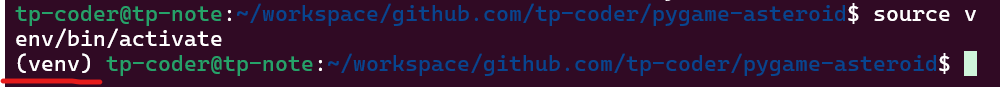

# pygame-asteroid

Thank you for accessing this Asteroids game repo!
This began as a guided Boot.dev project on their backend formation. Now I maintain it for fun and to test additional ideas to the game.

If you want to clone and play it yourself, go for it!  
Below are the steps to run it on your machine.

## Environment

The game was built using Windows Subsystem Linux - WSL. Thus if you are on a Windows System, first enable WSL.
Here are the steps to do it: [How to install WSL](https://learn.microsoft.com/en-us/windows/wsl/install).  
Now that we have a Linux environment, let's make the game work!

## Running the game

To run the game, follow the steps:

1. Enter on WSL if you are on Windows
2. Create a directory for the game
3. Clone the repository
4. Create a python virtual environment at the top of the game directory
   - run: `python3 -m venv venv`
5. Run the virtual environment - run `source venv/bin/activate`
   You should see a (venv) before the user
   
6. Install requirements, run: `pip install -requirements.txt`
7. Make sure you are on the main.py file folder
8. Run the game
   - run `python3 main.py`

## Features to come!

- [x] Add a scoring system
- [x] Implement multiple lives and respawning
- [x] Implemented Game Over window with possibility to restart or quit the game
- [x] Add control explanation before the game begins 
- [x] Reset asteroids on player death
- [x] Added highscore feature
- [ ] Add an explosion effect for the asteroids
- [ ] Add acceleration to the player movement
- [x] Make the objects wrap around the screen instead of disappearing
- [ ] Add a background image
- [ ] Create different weapon types
- [ ] Make the asteroids lumpy instead of perfectly round
- [ ] Make the ship have a triangular hit box instead of a circular one
- [ ] Add a shield power-up
- [ ] Add a speed power-up
- [ ] Add bombs that can be dropped

**I'll mark each idea as done as I go along.**
